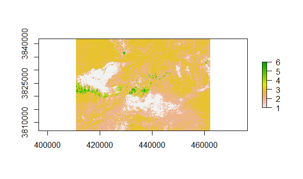
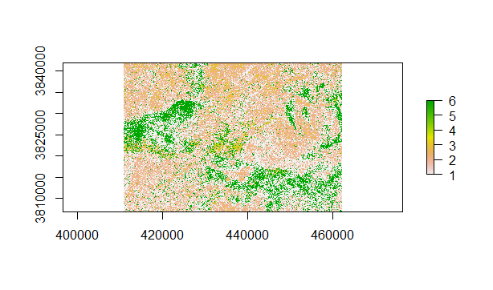

```{r setup, include=FALSE}
library(flexdashboard)
library(zoom)


knitr::opts_chunk$set(echo = FALSE)
```
Inputs {.sidebar}
-----------------------------------------------------------------------

```{css,echo=FALSE}
 body{
    text-align: justify;
   
 }
```

Palymra, an Ancient city in the centre of Syria located right next to the modern city "Tadmur".Since 1980, It has been recognised as UNESCO World Heritage site.In May 2015 the Activists took control over Palmyra/Tadmur and started to destroy the city and the archaeological sites.Temple of Bel,Tower of Elahbel,Arc of Triumph are notable archaelogical sites that has been destroyed during syrian civil War.


-----------------------------------------------------------------------
<script>
src="https://ajax.googleapis.com/ajax/libs/jquery/3.1.1/jquery.min.js"
</script>
<style>
.zoomDiv {
  opacity: 0;
  position:absolute;
  top: 50%;
  left: 50%;
  z-index: 50;
  transform: translate(-50%, -50%);
  box-shadow: 0px 0px 50px #888888;
  max-height:100%; 
  overflow: scroll;
}

.zoomImg {
  width: 100%;
}

</style>
$<script type="text/javascript">
  $(document).ready(function() {
    $('slides').prepend("<div class=\"zoomDiv\"></div>");
    // onClick function for all plots (img's)
    $('img:not(.zoomImg)').click(function() {
      $('.zoomImg').attr('src', $(this).attr('src'));
      $('.zoomDiv').css({opacity: '1', width: '60%'});
    });
    // onClick function for zoomImg
    $('img.zoomImg').click(function() {
      $('.zoomDiv').css({opacity: '0', width: '0%'});
    });
  });
</script>
-----------------------------------------------------------------------
### Before

```{r pressure, echo=FALSE, fig.cap="A caption", out.width = '100%'}


  

```
***
This is the Sentinel 2 image of palymra city taken during Aug 2015.The image is preprocessed and subjetced and supervised classification.The clusters has been plotted according to attributes of training datasets.


### After{data-commentary-width=400}


```{r,chunk-label,pre, echo=FALSE, fig.cap="A caption", out.width = '100%'}


```
***
This is the sentinel 2 of image of palymra city taken during Sep 2016.The image is preprocessed and subjetced and unsupervised classification.The clusters are classified based on K-means classification.The resulatant image is compared with previos image.

